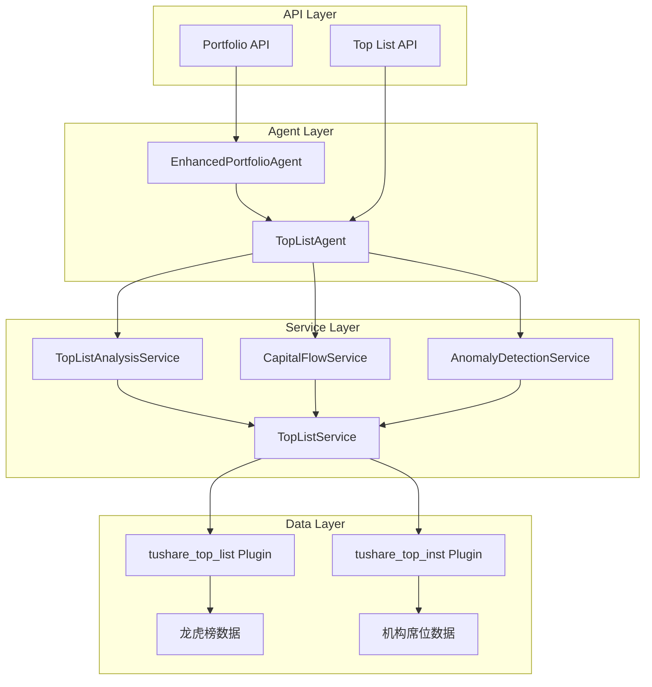

# Design: Top List Tracking System

## Architecture Overview



## Component Design

### 1. Data Plugins

#### TuShare Top List Plugin
```python
# tushare_top_list/extractor.py
class TopListExtractor(BaseExtractor):
    """龙虎榜数据提取器"""
    
    def extract_data(self, trade_date: str) -> pd.DataFrame:
        """提取指定日期的龙虎榜数据"""
        return self.api.top_list(trade_date=trade_date)
    
    def extract_top_inst(self, trade_date: str) -> pd.DataFrame:
        """提取机构席位数据"""
        return self.api.top_inst(trade_date=trade_date)
    
    def extract_batch_data(self, start_date: str, end_date: str) -> Dict[str, pd.DataFrame]:
        """批量提取历史数据"""
        results = {'top_list': pd.DataFrame(), 'top_inst': pd.DataFrame()}
        
        date_range = pd.date_range(start=start_date, end=end_date, freq='D')
        for date in date_range:
            trade_date = date.strftime('%Y%m%d')
            
            # 获取龙虎榜数据
            top_list_df = self.extract_data(trade_date)
            if not top_list_df.empty:
                results['top_list'] = pd.concat([results['top_list'], top_list_df])
            
            # 获取机构数据
            top_inst_df = self.extract_top_inst(trade_date)
            if not top_inst_df.empty:
                results['top_inst'] = pd.concat([results['top_inst'], top_inst_df])
            
            time.sleep(0.2)  # API 限流
        
        return results
```

### 2. Service Layer

#### TopListService
```python
class TopListService:
    """龙虎榜数据核心服务"""
    
    async def get_top_list_by_date(self, trade_date: str) -> List[Dict[str, Any]]:
        """获取指定日期龙虎榜数据"""
        
    async def get_top_inst_by_date(self, trade_date: str) -> List[Dict[str, Any]]:
        """获取指定日期机构席位数据"""
        
    async def get_stock_top_list_history(self, ts_code: str, days: int = 30) -> List[Dict[str, Any]]:
        """获取股票龙虎榜历史"""
        
    async def get_top_list_summary(self, trade_date: str) -> Dict[str, Any]:
        """获取龙虎榜摘要统计"""
```

#### TopListAnalysisService
```python
class TopListAnalysisService:
    """龙虎榜分析服务"""
    
    async def analyze_institutional_flow(self, trade_date: str) -> Dict[str, Any]:
        """分析机构资金流向"""
        top_inst_data = await self.top_list_service.get_top_inst_by_date(trade_date)
        
        analysis = {
            'net_buy_ranking': [],
            'active_institutions': [],
            'sector_preference': {},
            'trading_patterns': {}
        }
        
        # 计算机构净买入排行
        inst_summary = {}
        for record in top_inst_data:
            inst_name = record['exalter']
            if '机构' in inst_name:
                if inst_name not in inst_summary:
                    inst_summary[inst_name] = {'buy': 0, 'sell': 0, 'net_buy': 0}
                
                inst_summary[inst_name]['buy'] += record['buy']
                inst_summary[inst_name]['sell'] += record['sell']
                inst_summary[inst_name]['net_buy'] += record['net_buy']
        
        # 排序并返回
        analysis['net_buy_ranking'] = sorted(
            inst_summary.items(), 
            key=lambda x: x[1]['net_buy'], 
            reverse=True
        )[:20]
        
        return analysis
    
    async def identify_hot_money_targets(self, days: int = 5) -> List[Dict[str, Any]]:
        """识别游资目标股票"""
        
    async def calculate_seat_concentration(self, ts_code: str) -> Dict[str, Any]:
        """计算席位集中度"""
```

#### CapitalFlowService
```python
class CapitalFlowService:
    """资金流向分析服务"""
    
    async def analyze_capital_flow_trend(self, period: int = 7) -> Dict[str, Any]:
        """分析资金流向趋势"""
        
    async def identify_capital_anomalies(self, threshold: float = 3.0) -> List[Dict[str, Any]]:
        """识别资金异动"""
        
    async def track_institution_behavior(self, inst_name: str) -> Dict[str, Any]:
        """追踪机构行为"""
```

#### AnomalyDetectionService
```python
class AnomalyDetectionService:
    """异动检测服务"""
    
    async def detect_volume_anomalies(self, multiplier: float = 3.0) -> List[Dict[str, Any]]:
        """检测成交量异动"""
        
    async def detect_seat_concentration_anomalies(self) -> List[Dict[str, Any]]:
        """检测席位集中度异动"""
        
    async def generate_anomaly_alerts(self) -> List[Dict[str, Any]]:
        """生成异动预警"""
```

### 3. Agent Layer

#### TopListAgent
```python
class TopListAgent(LangGraphAgent):
    """龙虎榜智能代理"""
    
    tools = [
        "analyze_top_list_trends",
        "identify_institutional_behavior",
        "detect_capital_flow_anomalies",
        "generate_top_list_report"
    ]
    
    async def analyze_top_list_trends(self, period: int = 7) -> Dict[str, Any]:
        """分析龙虎榜趋势"""
        
    async def identify_institutional_behavior(self, ts_code: str) -> Dict[str, Any]:
        """识别机构行为模式"""
        
    async def detect_capital_flow_anomalies(self) -> List[Dict[str, Any]]:
        """检测资金流向异动"""
        
    async def generate_top_list_report(self, trade_date: str) -> Dict[str, Any]:
        """生成龙虎榜分析报告"""
```

## Data Models

### 龙虎榜数据模型
```sql
-- 龙虎榜主表
CREATE TABLE top_list (
    trade_date String,
    ts_code String,
    name String,
    close Float64,
    pct_chg Float64,
    turnover_rate Float64,
    amount Float64,
    l_sell Float64,
    l_buy Float64,
    l_amount Float64,
    net_amount Float64,
    net_rate Float64,
    amount_rate Float64,
    float_values Float64,
    reason String,
    created_at DateTime DEFAULT now()
) ENGINE = MergeTree()
PARTITION BY toYYYYMM(toDate(trade_date))
ORDER BY (trade_date, ts_code);

-- 机构席位表
CREATE TABLE top_inst (
    trade_date String,
    ts_code String,
    exalter String,
    buy Float64,
    buy_rate Float64,
    sell Float64,
    sell_rate Float64,
    net_buy Float64,
    created_at DateTime DEFAULT now()
) ENGINE = MergeTree()
PARTITION BY toYYYYMM(toDate(trade_date))
ORDER BY (trade_date, ts_code, exalter);

-- 席位分类表
CREATE TABLE seat_classification (
    seat_name String,
    seat_type Enum8('institution' = 1, 'hot_money' = 2, 'unknown' = 3),
    classification_confidence Float32,
    created_at DateTime DEFAULT now(),
    updated_at DateTime DEFAULT now()
) ENGINE = ReplacingMergeTree(updated_at)
ORDER BY seat_name;
```

## Integration Points

### 1. 与现有 Portfolio Agent 集成
```python
# enhanced_portfolio_agent.py 扩展
class EnhancedPortfolioAgent(LangGraphAgent):
    
    def __init__(self, config: AgentConfig):
        super().__init__(config)
        # 添加龙虎榜分析工具
        self.tools.extend([
            {
                "name": "analyze_portfolio_top_list",
                "description": "分析投资组合相关龙虎榜情况",
                "function": self.analyze_portfolio_top_list
            }
        ])
    
    async def analyze_portfolio_top_list(self, user_id: str) -> Dict[str, Any]:
        """分析投资组合相关的龙虎榜情况"""
        # 获取持仓股票
        positions = await self.portfolio_service.get_positions(user_id)
        
        # 分析持仓股票的龙虎榜情况
        top_list_analysis = await self.top_list_service.analyze_positions_top_list(positions)
        
        return {
            "positions_on_top_list": top_list_analysis['on_list_positions'],
            "capital_flow_analysis": top_list_analysis['capital_flow'],
            "risk_alerts": top_list_analysis['risk_alerts'],
            "investment_suggestions": top_list_analysis['suggestions']
        }
```

### 2. API 接口设计
```python
# top_list/api.py
@router.get("/top-list/{trade_date}")
async def get_top_list_by_date(trade_date: str):
    """获取指定日期龙虎榜数据"""
    
@router.get("/top-list/analysis/{trade_date}")
async def get_top_list_analysis(trade_date: str):
    """获取龙虎榜分析结果"""
    
@router.get("/capital-flow/trend")
async def get_capital_flow_trend(days: int = 7):
    """获取资金流向趋势"""
    
@router.get("/anomalies/detection")
async def get_anomaly_detection():
    """获取异动检测结果"""
    
@router.post("/monitoring/stocks")
async def add_monitoring_stocks(stocks: List[str]):
    """添加监控股票"""
```

## Performance Considerations

### 1. 数据更新策略
- **增量更新**：每日定时更新当日数据
- **历史回填**：支持历史数据批量导入
- **缓存机制**：热点数据 Redis 缓存

### 2. 查询优化
- **分区表**：按日期分区提升查询性能
- **索引优化**：关键字段建立索引
- **异步处理**：复杂分析异步执行

### 3. 扩展性设计
- **插件化架构**：支持新数据源快速接入
- **配置化分析**：分析规则可配置化
- **微服务化**：服务间松耦合设计

## Frontend Implementation

### 1. 页面架构设计

#### 龙虎榜主页面 (`TopListView.vue`)
```vue
<template>
  <div class="top-list-view">
    <t-card title="龙虎榜追踪" class="main-card">
      <template #actions>
        <t-space>
          <t-date-picker v-model="selectedDate" @change="handleDateChange" />
          <t-button theme="primary" @click="refreshData">
            <template #icon><RefreshIcon /></template>
            刷新数据
          </t-button>
        </t-space>
      </template>

      <!-- 概览统计 -->
      <div class="overview-section">
        <t-row :gutter="16">
          <t-col :span="3">
            <t-card class="stat-card">
              <div class="stat-number">{{ overview.totalStocks }}</div>
              <div class="stat-label">上榜股票</div>
            </t-card>
          </t-col>
          <t-col :span="3">
            <t-card class="stat-card">
              <div class="stat-number">{{ overview.totalAmount | formatAmount }}</div>
              <div class="stat-label">总成交额</div>
            </t-card>
          </t-col>
          <t-col :span="3">
            <t-card class="stat-card">
              <div class="stat-number">{{ overview.institutionCount }}</div>
              <div class="stat-label">机构席位</div>
            </t-card>
          </t-col>
          <t-col :span="3">
            <t-card class="stat-card">
              <div class="stat-number">{{ overview.hotMoneyCount }}</div>
              <div class="stat-label">游资席位</div>
            </t-card>
          </t-col>
        </t-row>
      </div>

      <!-- 标签页切换 -->
      <t-tabs v-model="activeTab" class="content-tabs">
        <t-tab-panel value="list" label="龙虎榜单">
          <TopListTable :data="topListData" :loading="loading" />
        </t-tab-panel>
        <t-tab-panel value="analysis" label="资金分析">
          <CapitalFlowAnalysis :date="selectedDate" />
        </t-tab-panel>
        <t-tab-panel value="monitoring" label="异动监控">
          <AnomalyMonitoring />
        </t-tab-panel>
        <t-tab-panel value="seats" label="席位追踪">
          <SeatTracking />
        </t-tab-panel>
      </t-tabs>
    </t-card>
  </div>
</template>
```

#### 龙虎榜表格组件 (`TopListTable.vue`)
```vue
<template>
  <div class="top-list-table">
    <t-table
      :data="data"
      :columns="columns"
      :loading="loading"
      :pagination="pagination"
      row-key="ts_code"
      @page-change="handlePageChange"
    >
      <template #name="{ row }">
        <t-link @click="showStockDetail(row.ts_code)">
          {{ row.name }}
        </t-link>
      </template>
      
      <template #pct_chg="{ row }">
        <span :class="getPctChgClass(row.pct_chg)">
          {{ row.pct_chg }}%
        </span>
      </template>
      
      <template #reason="{ row }">
        <t-tag :theme="getReasonTheme(row.reason)">
          {{ row.reason }}
        </t-tag>
      </template>
      
      <template #actions="{ row }">
        <t-space>
          <t-button size="small" variant="text" @click="showDetail(row)">
            详情
          </t-button>
          <t-button size="small" variant="text" @click="addToMonitoring(row)">
            监控
          </t-button>
        </t-space>
      </template>
    </t-table>
  </div>
</template>
```

#### 资金流向分析组件 (`CapitalFlowAnalysis.vue`)
```vue
<template>
  <div class="capital-flow-analysis">
    <t-row :gutter="16">
      <!-- 机构资金流向图表 -->
      <t-col :span="8">
        <t-card title="机构资金流向">
          <InstitutionFlowChart :data="institutionFlow" />
        </t-card>
      </t-col>
      
      <!-- 游资活跃度 -->
      <t-col :span="8">
        <t-card title="游资活跃度">
          <HotMoneyActivityChart :data="hotMoneyActivity" />
        </t-card>
      </t-col>
      
      <!-- 板块资金流向 -->
      <t-col :span="8">
        <t-card title="板块资金流向">
          <SectorFlowChart :data="sectorFlow" />
        </t-card>
      </t-col>
    </t-row>
    
    <!-- 详细分析表格 -->
    <t-card title="详细分析" class="mt-4">
      <t-tabs v-model="analysisTab">
        <t-tab-panel value="institution" label="机构分析">
          <InstitutionAnalysisTable :data="institutionAnalysis" />
        </t-tab-panel>
        <t-tab-panel value="hotmoney" label="游资分析">
          <HotMoneyAnalysisTable :data="hotMoneyAnalysis" />
        </t-tab-panel>
      </t-tabs>
    </t-card>
  </div>
</template>
```

### 2. 组件集成策略

#### 集成到现有页面
1. **行情分析页面集成**：在 `MarketView.vue` 中添加龙虎榜相关信息
```vue
<!-- 在 MarketView.vue 中添加 -->
<template #additional-info>
  <t-card title="龙虎榜信息" v-if="selectedStock">
    <TopListInfo :ts-code="selectedStock" :compact="true" />
  </t-card>
</template>
```

2. **持仓管理页面集成**：在 `PortfolioView.vue` 中显示持仓股票的龙虎榜状态
```vue
<!-- 在持仓列表中添加龙虎榜状态列 -->
<template #top-list-status="{ row }">
  <TopListStatusBadge :ts-code="row.ts_code" />
</template>
```

3. **智能选股页面集成**：在 `ScreenerView.vue` 中添加龙虎榜筛选条件
```vue
<!-- 添加龙虎榜筛选器 -->
<t-form-item label="龙虎榜筛选">
  <TopListFilter v-model="filters.topList" />
</t-form-item>
```

### 3. 路由配置

```typescript
// 在 router/index.ts 中添加
{
  path: '/toplist',
  name: 'TopList',
  component: () => import('@/views/toplist/TopListView.vue'),
  meta: { title: '龙虎榜追踪', icon: 'trending-up' }
}
```

### 4. API 接口层

#### TopList API Service (`api/toplist.ts`)
```typescript
import { request } from './index'

export interface TopListItem {
  trade_date: string
  ts_code: string
  name: string
  close: number
  pct_chg: number
  turnover_rate: number
  amount: number
  l_sell: number
  l_buy: number
  net_amount: number
  reason: string
}

export interface TopListQuery {
  trade_date?: string
  ts_code?: string
  page?: number
  size?: number
}

export const topListApi = {
  // 获取龙虎榜数据
  getTopList: (params: TopListQuery) =>
    request.get<TopListItem[]>('/api/top-list', { params }),
  
  // 获取龙虎榜分析
  getTopListAnalysis: (trade_date: string) =>
    request.get(`/api/top-list/analysis/${trade_date}`),
  
  // 获取机构席位数据
  getInstitutionSeats: (params: TopListQuery) =>
    request.get('/api/top-list/institution-seats', { params }),
  
  // 获取资金流向分析
  getCapitalFlow: (days: number = 7) =>
    request.get('/api/capital-flow/trend', { params: { days } }),
  
  // 获取异动检测结果
  getAnomalies: () =>
    request.get('/api/anomalies/detection'),
  
  // 添加监控股票
  addMonitoringStock: (ts_codes: string[]) =>
    request.post('/api/monitoring/stocks', { ts_codes }),
  
  // 获取股票龙虎榜历史
  getStockTopListHistory: (ts_code: string, days: number = 30) =>
    request.get(`/api/top-list/stock/${ts_code}/history`, { params: { days } })
}
```

### 5. 状态管理 (Pinia Store)

#### TopList Store (`stores/toplist.ts`)
```typescript
import { defineStore } from 'pinia'
import { topListApi } from '@/api/toplist'

export const useTopListStore = defineStore('toplist', {
  state: () => ({
    topListData: [] as TopListItem[],
    overview: {
      totalStocks: 0,
      totalAmount: 0,
      institutionCount: 0,
      hotMoneyCount: 0
    },
    loading: false,
    selectedDate: new Date().toISOString().split('T')[0],
    monitoringStocks: [] as string[]
  }),
  
  actions: {
    async fetchTopList(date?: string) {
      this.loading = true
      try {
        const tradeDate = date || this.selectedDate
        const response = await topListApi.getTopList({ trade_date: tradeDate })
        this.topListData = response.data
        await this.fetchOverview(tradeDate)
      } finally {
        this.loading = false
      }
    },
    
    async fetchOverview(date: string) {
      const analysis = await topListApi.getTopListAnalysis(date)
      this.overview = analysis.data.overview
    },
    
    async addToMonitoring(ts_code: string) {
      if (!this.monitoringStocks.includes(ts_code)) {
        this.monitoringStocks.push(ts_code)
        await topListApi.addMonitoringStock([ts_code])
      }
    }
  }
})
```

### 6. 可复用组件库

#### TopListStatusBadge 组件
```vue
<template>
  <t-badge
    v-if="status"
    :count="status.count"
    :theme="status.theme"
    :title="status.title"
  >
    <t-icon :name="status.icon" />
  </t-badge>
</template>

<script setup lang="ts">
interface Props {
  tsCode: string
}

const props = defineProps<Props>()
const status = computed(() => {
  // 根据股票代码获取龙虎榜状态
  return getTopListStatus(props.tsCode)
})
</script>
```

#### TopListFilter 组件
```vue
<template>
  <t-space direction="vertical" class="top-list-filter">
    <t-checkbox-group v-model="selectedReasons">
      <t-checkbox value="涨幅偏离值达7%">涨幅偏离值达7%</t-checkbox>
      <t-checkbox value="跌幅偏离值达7%">跌幅偏离值达7%</t-checkbox>
      <t-checkbox value="换手率达20%">换手率达20%</t-checkbox>
      <t-checkbox value="连续三个交易日内涨幅偏离值累计达20%">连续涨幅偏离</t-checkbox>
    </t-checkbox-group>
    
    <t-input-number
      v-model="minAmount"
      label="最小成交额(万元)"
      :min="0"
      placeholder="请输入最小成交额"
    />
  </t-space>
</template>
```

## Security & Compliance

### 1. 数据安全
- **API 限流**：防止过度调用
- **数据脱敏**：敏感信息处理
- **访问控制**：基于角色的权限管理

### 2. 合规性
- **数据来源**：确保数据来源合法合规
- **使用限制**：遵守数据提供商使用条款
- **隐私保护**：用户数据隐私保护