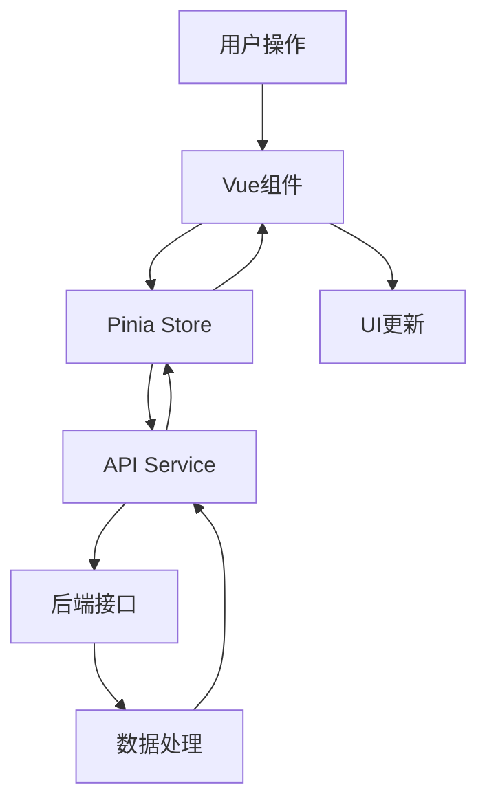
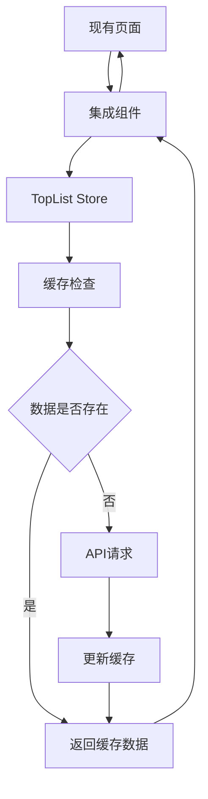

# Frontend Integration Specification

## Overview

本规范详细描述龙虎榜追踪系统的前端实现和与现有页面的集成方案。基于现有的 Vue 3 + TypeScript + TDesign 技术栈，提供完整的用户界面和交互体验。

## 页面架构

### 1. 独立龙虎榜页面

#### 1.1 主页面路由
```typescript
// 新增路由配置
{
  path: '/toplist',
  name: 'TopList',
  component: () => import('@/views/toplist/TopListView.vue'),
  meta: { title: '龙虎榜追踪', icon: 'trending-up' }
}
```

#### 1.2 页面结构
```
/views/toplist/
├── TopListView.vue           # 主页面
├── components/
│   ├── TopListTable.vue      # 龙虎榜表格
│   ├── CapitalFlowAnalysis.vue # 资金流向分析
│   ├── AnomalyMonitoring.vue # 异动监控
│   ├── SeatTracking.vue      # 席位追踪
│   ├── TopListOverview.vue   # 概览统计
│   └── charts/
│       ├── InstitutionFlowChart.vue  # 机构流向图
│       ├── HotMoneyActivityChart.vue # 游资活跃度图
│       └── SectorFlowChart.vue       # 板块流向图
```

### 2. 现有页面集成

#### 2.1 行情分析页面 (`MarketView.vue`)
**集成位置**: 股票详情区域下方
**集成内容**: 
- 选中股票的龙虎榜历史
- 最近上榜情况
- 机构和游资关注度

```vue
<!-- 在 MarketView.vue 中添加 -->
<div v-if="selectedStock" class="additional-info">
  <t-card title="龙虎榜信息" class="mt-4">
    <TopListStockInfo :ts-code="selectedStock" />
  </t-card>
</div>
```

#### 2.2 持仓管理页面 (`PortfolioView.vue`)
**集成位置**: 持仓列表中新增列
**集成内容**:
- 持仓股票龙虎榜状态徽章
- 最近上榜时间
- 资金流向提示

```vue
<!-- 在持仓表格中添加列 -->
<t-table-column title="龙虎榜" width="120">
  <template #default="{ row }">
    <TopListStatusBadge :ts-code="row.ts_code" />
  </template>
</t-table-column>
```

#### 2.3 智能选股页面 (`ScreenerView.vue`)
**集成位置**: 筛选条件区域
**集成内容**:
- 龙虎榜筛选条件
- 机构关注度筛选
- 异动股票筛选

```vue
<!-- 在筛选条件中添加 -->
<t-form-item label="龙虎榜筛选">
  <TopListScreenFilter v-model="filters.topList" />
</t-form-item>
```

## 组件设计

### 1. 核心展示组件

#### 1.1 TopListTable 组件
**功能**: 龙虎榜数据表格展示
**特性**:
- 支持分页、排序、筛选
- 股票名称点击查看详情
- 涨跌幅颜色区分
- 上榜原因标签展示
- 快速添加监控功能

```vue
<template>
  <t-table
    :data="data"
    :columns="columns"
    :loading="loading"
    :pagination="pagination"
    row-key="ts_code"
  >
    <!-- 自定义列模板 -->
  </t-table>
</template>
```

#### 1.2 CapitalFlowAnalysis 组件
**功能**: 资金流向分析展示
**特性**:
- 机构资金净流入排行
- 游资活跃度分析
- 板块资金流向分布
- 时间范围选择

### 2. 集成组件

#### 2.1 TopListStatusBadge 组件
**用途**: 在其他页面显示股票龙虎榜状态
**特性**:
- 紧凑的徽章样式
- 颜色区分不同状态
- 悬浮提示详细信息

```vue
<template>
  <t-badge
    v-if="status"
    :count="status.days"
    :theme="status.theme"
    :title="status.tooltip"
  >
    <t-icon name="trending-up" />
  </t-badge>
</template>
```

#### 2.2 TopListStockInfo 组件
**用途**: 在行情页面显示股票龙虎榜信息
**特性**:
- 最近上榜记录
- 机构和游资关注情况
- 资金流向趋势

#### 2.3 TopListScreenFilter 组件
**用途**: 在选股页面提供龙虎榜筛选条件
**特性**:
- 上榜原因筛选
- 成交额范围筛选
- 时间范围筛选

## 状态管理

### 1. TopList Store

```typescript
// stores/toplist.ts
export const useTopListStore = defineStore('toplist', {
  state: () => ({
    // 龙虎榜数据
    topListData: [] as TopListItem[],
    
    // 概览统计
    overview: {
      totalStocks: 0,
      totalAmount: 0,
      institutionCount: 0,
      hotMoneyCount: 0
    },
    
    // 分析数据
    capitalFlow: {
      institutionFlow: [],
      hotMoneyActivity: [],
      sectorFlow: []
    },
    
    // 异动监控
    anomalies: [] as AnomalyItem[],
    monitoringStocks: [] as string[],
    
    // UI 状态
    loading: false,
    selectedDate: getCurrentDate(),
    activeTab: 'list'
  }),
  
  actions: {
    // 数据获取方法
    async fetchTopList(date?: string) { },
    async fetchCapitalFlow(days: number = 7) { },
    async fetchAnomalies() { },
    
    // 监控管理
    async addToMonitoring(ts_code: string) { },
    async removeFromMonitoring(ts_code: string) { }
  }
})
```

### 2. 与现有 Store 集成

#### 2.1 Market Store 扩展
```typescript
// 在 stores/market.ts 中添加
export const useMarketStore = defineStore('market', {
  actions: {
    // 获取股票龙虎榜信息
    async fetchStockTopListInfo(ts_code: string) {
      const topListStore = useTopListStore()
      return await topListStore.getStockTopListHistory(ts_code)
    }
  }
})
```

#### 2.2 Portfolio Store 扩展
```typescript
// 在 stores/portfolio.ts 中添加
export const usePortfolioStore = defineStore('portfolio', {
  getters: {
    // 持仓股票龙虎榜状态
    positionsWithTopListStatus: (state) => {
      const topListStore = useTopListStore()
      return state.positions.map(position => ({
        ...position,
        topListStatus: topListStore.getStockStatus(position.ts_code)
      }))
    }
  }
})
```

## API 接口层

### 1. TopList API Service

```typescript
// api/toplist.ts
export const topListApi = {
  // 基础数据接口
  getTopList: (params: TopListQuery) => 
    request.get<TopListItem[]>('/api/top-list', { params }),
  
  getTopListAnalysis: (trade_date: string) =>
    request.get(`/api/top-list/analysis/${trade_date}`),
  
  // 分析接口
  getCapitalFlow: (days: number = 7) =>
    request.get('/api/capital-flow/trend', { params: { days } }),
  
  getInstitutionAnalysis: (trade_date: string) =>
    request.get(`/api/top-list/institution-analysis/${trade_date}`),
  
  // 监控接口
  getAnomalies: () =>
    request.get('/api/anomalies/detection'),
  
  addMonitoringStock: (ts_codes: string[]) =>
    request.post('/api/monitoring/stocks', { ts_codes }),
  
  // 集成接口
  getStockTopListHistory: (ts_code: string, days: number = 30) =>
    request.get(`/api/top-list/stock/${ts_code}/history`, { params: { days } }),
  
  getStockTopListStatus: (ts_codes: string[]) =>
    request.post('/api/top-list/batch-status', { ts_codes })
}
```

## 数据流设计

### 1. 页面数据流



### 2. 集成数据流



## 用户体验设计

### 1. 响应式设计
- **桌面端**: 完整功能展示，多列布局
- **平板端**: 适配中等屏幕，部分功能折叠
- **移动端**: 简化界面，关键信息优先

### 2. 加载状态
- **骨架屏**: 数据加载时显示结构化占位符
- **进度指示**: 长时间操作显示进度条
- **错误处理**: 友好的错误提示和重试机制

### 3. 交互优化
- **快捷操作**: 一键添加监控、快速筛选
- **智能提示**: 异动股票高亮显示
- **数据刷新**: 自动刷新和手动刷新结合

## 性能优化

### 1. 数据优化
- **分页加载**: 大数据集分页展示
- **虚拟滚动**: 长列表虚拟化渲染
- **数据缓存**: 合理的缓存策略

### 2. 组件优化
- **懒加载**: 非关键组件懒加载
- **组件复用**: 相似组件抽象复用
- **计算缓存**: computed 和 watch 优化

### 3. 网络优化
- **请求合并**: 批量请求减少网络开销
- **预加载**: 预测用户行为提前加载
- **错误重试**: 网络错误自动重试机制

## 测试策略

### 1. 单元测试
- 组件功能测试
- Store 状态管理测试
- API 接口测试

### 2. 集成测试
- 页面集成测试
- 数据流测试
- 用户交互测试

### 3. E2E 测试
- 完整用户流程测试
- 跨页面功能测试
- 性能基准测试

## 部署和维护

### 1. 构建优化
- 代码分割和懒加载
- 资源压缩和优化
- CDN 部署策略

### 2. 监控和分析
- 用户行为分析
- 性能监控
- 错误日志收集

### 3. 版本管理
- 渐进式发布
- 功能开关控制
- 回滚机制